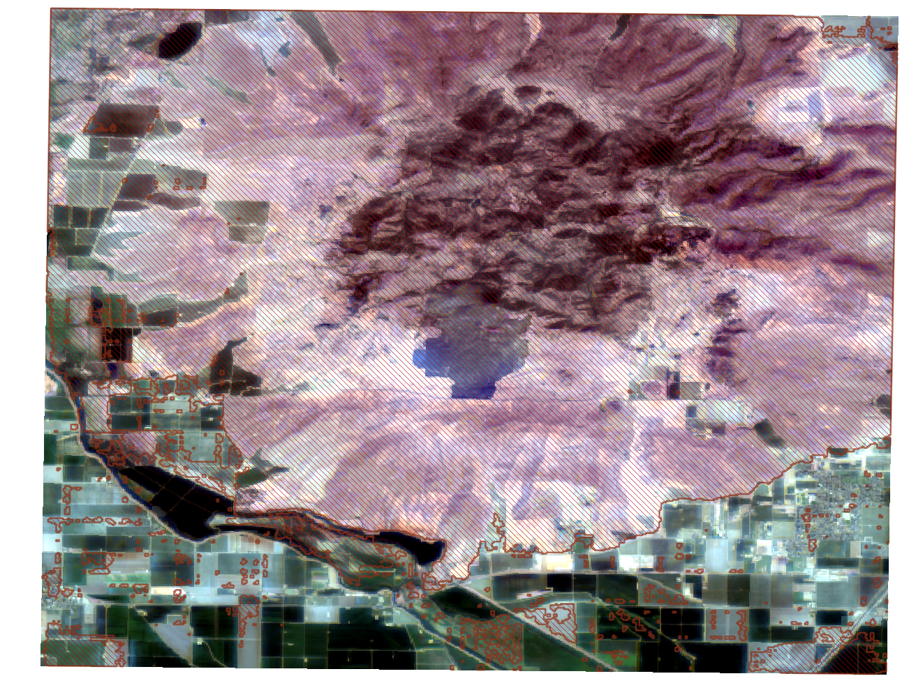

# Segment Anything Encoder and Decoder as Services





## Quickstart

### Building the container for creating the .mar archives

Both models will be downloaded using the vit_h weights.

```
docker build -t sam-builder -f Dockerfile-build .
```

### Copying the .mar archives to host for local testing

```
docker run -d --name sam-builder1 sam-builder
docker cp sam-builder1:/home/model-store ./
```

We copy these to model-store and use this locally by both the GPU and the CPU Torchserve containers.

you can delete the container once models are copied

```
docker rm -f sam-builder1
```

### Building the gpu torchserve container for image encoding
With the GPU, inference time should be about 1.8 seconds or less depending on the GPU. On an older 1080 Ti Pascal GPU, inference time is 1.67 seconds without compilation.

```
docker build -t sam-gpu -f Dockerfile-gpu .
bash start_serve_encode_gpu.sh
```

### Building the cpu torchserve container for image decoding

```
docker build -t sam-cpu -f Dockerfile-cpu .
bash start_serve_decode_cpu.sh
```

### Test the encode service on the CPU
The CPU service is served on 7080 by default. 8080 for the GPU service by default.
```
curl http://127.0.0.1:7080/predictions/sam_vit_h_encode -T ./data/sample-img-fox.jpg
```

## Local Setup without Docker

### 1. Downloading model weights

If you have access, download from the devseed s3:

```
aws s3 sync s3://segment-anything/model-weights/ model-weights
```

otherwise, get checkpoints from the original repo: https://github.com/facebookresearch/segment-anything/tree/main#model-checkpoints

### 2a. Package the torch weights for GPU encoding

This step takes a long time presumably because the uncompiled weights are massive. Packaging the ONNX model is faster in the later steps.

```
mkdir -p model_store_encode
torch-model-archiver --model-name sam_vit_h_encode --version 1.0.0 --serialized-file model-weights/sam_vit_h_4b8939.pth --handler handler_encode.py
mv sam_vit_h_encode.mar model_store_encode/sam_vit_h_encode.mar
```

### 2b. Exporting the ONNX model for CPU decoding

```
mkdir -p models
python scripts/export_onnx_model.py --checkpoint model-weights/sam_vit_h_4b8939.pth --model-type vit_h --output models/sam_vit_h_decode.onnx
```

### 2c. Package the ONNX model for CPU decoding with the handler

We'll put this in the model_store_decode directory, to keep the onnx model files distinct from the torchserve .mar model archives. model_store/ is created automatically by Torchserve in the container, which is why we're make a local folder here called "model_store_decode".

```
mkdir -p model_store_decode
torch-model-archiver --model-name sam_vit_h_decode --version 1.0.0 --serialized-file models/sam_vit_h_decode.onnx --handler handler_decode.py
mv sam_vit_h_decode.mar model_store_decode/sam_vit_h_decode.mar
```

### Building jupyter server container

Use this container to test the model in a GPU enabled jupyter notebook server with geospatial and pytorch dependencies installed.

```
docker build -t sam-dev -f Dockerfile-dev .
```

### 5. Test the endpoints

You can run `test_endpoint.ipynb` to then use the two running services you started above. The dependencies are minimal for this notebook, install them on your own or you can run them in the jupyter server below.

### 6. Run jupyter server container

This is a GPU enabled container that is set up with SAM and some other dependencies we commonly use. You can use it to try out SAM model in a notebook environment. Remove the `--gpus` arg if you don't have a GPU.

```
docker run -it --rm \
    -v $HOME/.aws:/root/.aws \
    -v "$(pwd)":/segment-anything-services \
    -p 8888:8888 \
    -e AWS_PROFILE=devseed \
    --gpus all sam-dev
```

### (Potentially) Frequently Asked Questions
Q: What GPUs was this tested with?

A: The encoder and decoder are tested locally with a 1080 Ti (Pascal) and 3090 (Ampere). In production, the encoder runs on a p3.2xlarge (Tesla V100). Older Kepler GPUs such as K80s are not tested. See [this issue](https://github.com/developmentseed/segment-anything-services/issues/36) for guidance on adapting the docker images to work with Kepler series GPUs.

Q: Why two services?

A: We're exploring cost effective ways to run image encoding in a separate, on-demand way from the CPU decoder. Eventually we'd like to remove the need for the CPU torserve on the backend and run the decoding in the browser.

Q: Can I contribute or ask questions?

A: This is currently more of a "working in the open" type repo that we'd like to share with others, rather than a maintained project. But feel free to open an issue if you have an idea. Please understand if we don't respond or are slow to respond.

### Contributing and packaging

We use hatch to build the sam-serve package. This wheel file is built from source when building the cpu or gpu docker images. We also use hatch to publish the package to PYPI. We don't have CI CD yet, so if you are interested in contributing, increment the version in your PR and notify the maintainers @rbavery or @rub21 and we will publish the package on PR merge.

The main commands are

`hatch build` to make the whl file

`hatch publish` to publish a release

hatch can be installed with pip or pipx

`pip install hatch`

## License

The model and code is licensed under the [Apache 2.0 license](LICENSE).

## References

Kirillov, A., Mintun, E., Ravi, N., Mao, H., Rolland, C., Gustafson, L., ... Girshick, R. (2023). Segment Anything. *arXiv:2304.02643*. https://github.com/facebookresearch/segment-anything

The scripts/export_onnx_model.ipynb and notebooks/sam_onnx_model_example_fox.ipynb are from the original repo.
